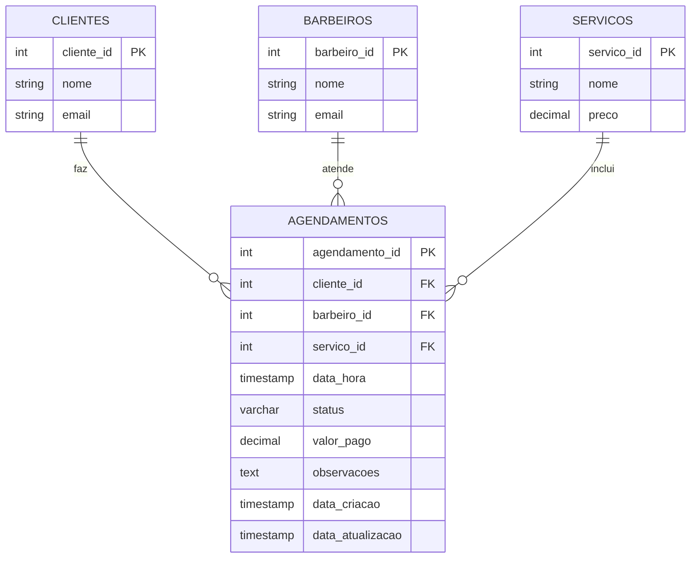

# Atributos da Tabela AGENDAMENTOS

## Estrutura da Tabela AGENDAMENTOS

```sql
CREATE TABLE agendamentos (
    agendamento_id SERIAL PRIMARY KEY,
    cliente_id INTEGER NOT NULL,
    barbeiro_id INTEGER NOT NULL,
    servico_id INTEGER NOT NULL,
    data_hora TIMESTAMP NOT NULL,
    status VARCHAR(20) DEFAULT 'agendado',
    valor_pago DECIMAL(10,2),
    observacoes TEXT,
    data_criacao TIMESTAMP DEFAULT CURRENT_TIMESTAMP,
    data_atualizacao TIMESTAMP DEFAULT CURRENT_TIMESTAMP
);
```

## Detalhamento dos Atributos

### **Atributos Obrigatórios (NOT NULL)**

| Atributo | Tipo | Descrição | Exemplo |
|----------|------|-----------|---------|
| `agendamento_id` | SERIAL | Chave primária auto-incremento | 1, 2, 3... |
| `cliente_id` | INTEGER | ID do cliente que fez o agendamento | 15 |
| `barbeiro_id` | INTEGER | ID do barbeiro que irá atender | 3 |
| `servico_id` | INTEGER | ID do serviço solicitado | 2 |
| `data_hora` | TIMESTAMP | Data e hora do agendamento | '2024-01-15 14:30:00' |

### **Atributos Opcionais**

| Atributo | Tipo | Valor Padrão | Descrição | Exemplo |
|----------|------|--------------|-----------|---------|
| `status` | VARCHAR(20) | 'agendado' | Status atual do agendamento | 'confirmado' |
| `valor_pago` | DECIMAL(10,2) | NULL | Valor pago pelo serviço | 25.00 |
| `observacoes` | TEXT | NULL | Observações especiais | 'Cliente prefere corte mais curto' |
| `data_criacao` | TIMESTAMP | CURRENT_TIMESTAMP | Quando o agendamento foi criado | '2024-01-10 10:15:00' |
| `data_atualizacao` | TIMESTAMP | CURRENT_TIMESTAMP | Última atualização do registro | '2024-01-12 16:20:00' |

## Valores Possíveis para STATUS

```sql
CHECK (status IN (
    'agendado',      -- Agendamento criado, aguardando confirmação
    'confirmado',    -- Cliente confirmou presença
    'em_andamento',  -- Barbeiro iniciou o atendimento
    'concluido',     -- Serviço finalizado com sucesso
    'cancelado',     -- Agendamento cancelado
    'nao_compareceu' -- Cliente não compareceu
))
```

## Exemplos de Registros

### Exemplo 1: Agendamento Básico
```sql
INSERT INTO agendamentos (
    cliente_id, barbeiro_id, servico_id, data_hora
) VALUES (
    15, 3, 2, '2024-01-15 14:30:00'
);
```

### Exemplo 2: Agendamento Completo
```sql
INSERT INTO agendamentos (
    cliente_id, barbeiro_id, servico_id, data_hora, 
    status, valor_pago, observacoes
) VALUES (
    15, 3, 2, '2024-01-15 14:30:00',
    'confirmado', 25.00, 'Cliente prefere corte mais curto na lateral'
);
```

## Constraints e Validações

### **Constraints de Integridade**
```sql
-- Chave primária
PRIMARY KEY (agendamento_id)

-- Chaves estrangeiras (referências)
FOREIGN KEY (cliente_id) REFERENCES clientes(cliente_id)
FOREIGN KEY (barbeiro_id) REFERENCES barbeiros(barbeiro_id)  
FOREIGN KEY (servico_id) REFERENCES servicos(servico_id)

-- Validação de status
CHECK (status IN ('agendado', 'confirmado', 'em_andamento', 'concluido', 'cancelado', 'nao_compareceu'))

-- Validação de valor
CHECK (valor_pago >= 0)
```

### **Validações de Negócio**
```sql
-- Não permitir agendamentos no passado
CHECK (data_hora > CURRENT_TIMESTAMP)

-- Não permitir agendamentos fora do horário comercial (8h-18h)
CHECK (EXTRACT(HOUR FROM data_hora) BETWEEN 8 AND 17)

-- Não permitir agendamentos em domingos
CHECK (EXTRACT(DOW FROM data_hora) != 0)
```

## Índices Recomendados

```sql
-- Índice para consultas por data/hora
CREATE INDEX idx_agendamentos_data_hora ON agendamentos(data_hora);

-- Índice para consultas por cliente
CREATE INDEX idx_agendamentos_cliente ON agendamentos(cliente_id);

-- Índice para consultas por barbeiro
CREATE INDEX idx_agendamentos_barbeiro ON agendamentos(barbeiro_id);

-- Índice para consultas por status
CREATE INDEX idx_agendamentos_status ON agendamentos(status);

-- Índice composto para consultas de disponibilidade
CREATE INDEX idx_agendamentos_barbeiro_data ON agendamentos(barbeiro_id, data_hora);
```

## Trigger para Atualização Automática

```sql
-- Função para atualizar data_atualizacao automaticamente
CREATE OR REPLACE FUNCTION update_agendamento_timestamp()
RETURNS TRIGGER AS $$
BEGIN
    NEW.data_atualizacao = CURRENT_TIMESTAMP;
    RETURN NEW;
END;
$$ LANGUAGE plpgsql;

-- Trigger que executa a função em cada UPDATE
CREATE TRIGGER trigger_update_agendamento
    BEFORE UPDATE ON agendamentos
    FOR EACH ROW
    EXECUTE FUNCTION update_agendamento_timestamp();
```

## Consultas Úteis

### **Buscar agendamentos de um cliente**
```sql
SELECT * FROM agendamentos 
WHERE cliente_id = 15 
ORDER BY data_hora DESC;
```

### **Buscar agendamentos de um barbeiro em uma data**
```sql
SELECT * FROM agendamentos 
WHERE barbeiro_id = 3 
AND DATE(data_hora) = '2024-01-15'
ORDER BY data_hora;
```

### **Verificar disponibilidade de um barbeiro**
```sql
SELECT * FROM agendamentos 
WHERE barbeiro_id = 3 
AND data_hora BETWEEN '2024-01-15 14:00:00' AND '2024-01-15 15:00:00'
AND status NOT IN ('cancelado', 'nao_compareceu');
```

### **Agendamentos por status**
```sql
SELECT status, COUNT(*) as quantidade 
FROM agendamentos 
GROUP BY status;
```

## Relacionamentos da Tabela AGENDAMENTOS



## Resumo dos Atributos

| **Total de Atributos: 10** |
|----------------------------|
| **Obrigatórios: 5** |
| **Opcionais: 5** |
| **Chaves: 1 (PK) + 3 (FK)** |
| **Campos de Controle: 2** (data_criacao, data_atualizacao) |
| **Campos de Negócio: 5** (cliente_id, barbeiro_id, servico_id, data_hora, status) |
| **Campos Auxiliares: 2** (valor_pago, observacoes) |

