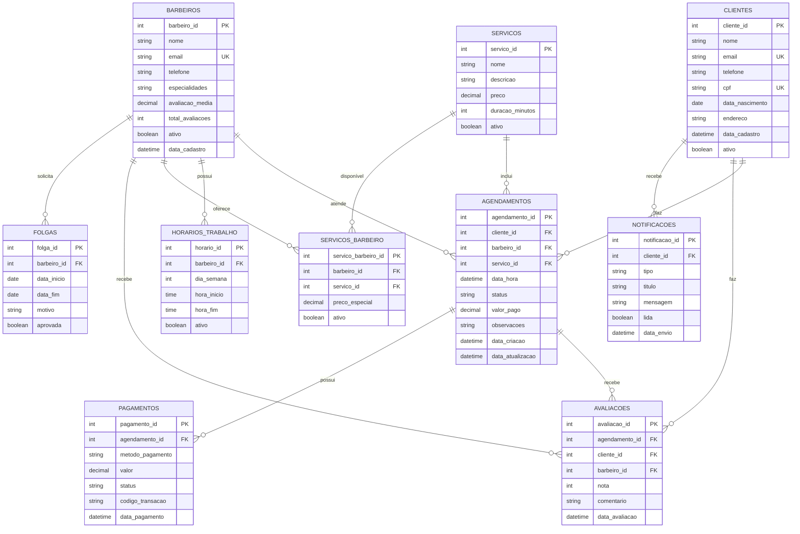

# Diagrama de Banco de Dados - Sistema de Agendamento de Barbearia

## Diagrama de Relacionamentos (ERD)



## Estrutura Detalhada das Tabelas

### 1. **CLIENTES**
```sql
CREATE TABLE clientes (
    cliente_id SERIAL PRIMARY KEY,
    nome VARCHAR(100) NOT NULL,
    email VARCHAR(100) UNIQUE NOT NULL,
    telefone VARCHAR(20) NOT NULL,
    cpf VARCHAR(14) UNIQUE NOT NULL,
    data_nascimento DATE,
    endereco TEXT,
    data_cadastro TIMESTAMP DEFAULT CURRENT_TIMESTAMP,
    ativo BOOLEAN DEFAULT TRUE
);
```

### 2. **BARBEIROS**
```sql
CREATE TABLE barbeiros (
    barbeiro_id SERIAL PRIMARY KEY,
    nome VARCHAR(100) NOT NULL,
    email VARCHAR(100) UNIQUE NOT NULL,
    telefone VARCHAR(20) NOT NULL,
    especialidades TEXT,
    avaliacao_media DECIMAL(3,2) DEFAULT 0.00,
    total_avaliacoes INTEGER DEFAULT 0,
    ativo BOOLEAN DEFAULT TRUE,
    data_cadastro TIMESTAMP DEFAULT CURRENT_TIMESTAMP
);
```

### 3. **SERVICOS**
```sql
CREATE TABLE servicos (
    servico_id SERIAL PRIMARY KEY,
    nome VARCHAR(100) NOT NULL,
    descricao TEXT,
    preco DECIMAL(10,2) NOT NULL,
    duracao_minutos INTEGER NOT NULL,
    ativo BOOLEAN DEFAULT TRUE
);
```

### 4. **HORARIOS_TRABALHO**
```sql
CREATE TABLE horarios_trabalho (
    horario_id SERIAL PRIMARY KEY,
    barbeiro_id INTEGER REFERENCES barbeiros(barbeiro_id),
    dia_semana INTEGER NOT NULL CHECK (dia_semana BETWEEN 0 AND 6),
    hora_inicio TIME NOT NULL,
    hora_fim TIME NOT NULL,
    ativo BOOLEAN DEFAULT TRUE
);
```

### 5. **AGENDAMENTOS**
```sql
CREATE TABLE agendamentos (
    agendamento_id SERIAL PRIMARY KEY,
    cliente_id INTEGER REFERENCES clientes(cliente_id),
    barbeiro_id INTEGER REFERENCES barbeiros(barbeiro_id),
    servico_id INTEGER REFERENCES servicos(servico_id),
    data_hora TIMESTAMP NOT NULL,
    status VARCHAR(20) DEFAULT 'agendado' CHECK (status IN ('agendado', 'confirmado', 'em_andamento', 'concluido', 'cancelado', 'nao_compareceu')),
    valor_pago DECIMAL(10,2),
    observacoes TEXT,
    data_criacao TIMESTAMP DEFAULT CURRENT_TIMESTAMP,
    data_atualizacao TIMESTAMP DEFAULT CURRENT_TIMESTAMP
);
```

### 6. **SERVICOS_BARBEIRO**
```sql
CREATE TABLE servicos_barbeiro (
    servico_barbeiro_id SERIAL PRIMARY KEY,
    barbeiro_id INTEGER REFERENCES barbeiros(barbeiro_id),
    servico_id INTEGER REFERENCES servicos(servico_id),
    preco_especial DECIMAL(10,2),
    ativo BOOLEAN DEFAULT TRUE,
    UNIQUE(barbeiro_id, servico_id)
);
```

### 7. **AVALIACOES**
```sql
CREATE TABLE avaliacoes (
    avaliacao_id SERIAL PRIMARY KEY,
    agendamento_id INTEGER REFERENCES agendamentos(agendamento_id),
    cliente_id INTEGER REFERENCES clientes(cliente_id),
    barbeiro_id INTEGER REFERENCES barbeiros(barbeiro_id),
    nota INTEGER NOT NULL CHECK (nota BETWEEN 1 AND 5),
    comentario TEXT,
    data_avaliacao TIMESTAMP DEFAULT CURRENT_TIMESTAMP
);
```

### 8. **PAGAMENTOS**
```sql
CREATE TABLE pagamentos (
    pagamento_id SERIAL PRIMARY KEY,
    agendamento_id INTEGER REFERENCES agendamentos(agendamento_id),
    metodo_pagamento VARCHAR(20) NOT NULL,
    valor DECIMAL(10,2) NOT NULL,
    status VARCHAR(20) DEFAULT 'pendente' CHECK (status IN ('pendente', 'aprovado', 'rejeitado', 'cancelado')),
    codigo_transacao VARCHAR(100),
    data_pagamento TIMESTAMP
);
```

### 9. **NOTIFICACOES**
```sql
CREATE TABLE notificacoes (
    notificacao_id SERIAL PRIMARY KEY,
    cliente_id INTEGER REFERENCES clientes(cliente_id),
    tipo VARCHAR(20) NOT NULL,
    titulo VARCHAR(100) NOT NULL,
    mensagem TEXT NOT NULL,
    lida BOOLEAN DEFAULT FALSE,
    data_envio TIMESTAMP DEFAULT CURRENT_TIMESTAMP
);
```

### 10. **FOLGAS**
```sql
CREATE TABLE folgas (
    folga_id SERIAL PRIMARY KEY,
    barbeiro_id INTEGER REFERENCES barbeiros(barbeiro_id),
    data_inicio DATE NOT NULL,
    data_fim DATE NOT NULL,
    motivo TEXT,
    aprovada BOOLEAN DEFAULT FALSE
);
```

## Índices para Performance

```sql
-- Índices para consultas frequentes
CREATE INDEX idx_agendamentos_data_hora ON agendamentos(data_hora);
CREATE INDEX idx_agendamentos_cliente ON agendamentos(cliente_id);
CREATE INDEX idx_agendamentos_barbeiro ON agendamentos(barbeiro_id);
CREATE INDEX idx_agendamentos_status ON agendamentos(status);
CREATE INDEX idx_horarios_barbeiro_dia ON horarios_trabalho(barbeiro_id, dia_semana);
CREATE INDEX idx_avaliacoes_barbeiro ON avaliacoes(barbeiro_id);
CREATE INDEX idx_notificacoes_cliente ON notificacoes(cliente_id);
```

## Triggers para Atualizações Automáticas

```sql
-- Trigger para atualizar data_atualizacao em agendamentos
CREATE OR REPLACE FUNCTION update_agendamento_timestamp()
RETURNS TRIGGER AS $$
BEGIN
    NEW.data_atualizacao = CURRENT_TIMESTAMP;
    RETURN NEW;
END;
$$ LANGUAGE plpgsql;

CREATE TRIGGER trigger_update_agendamento
    BEFORE UPDATE ON agendamentos
    FOR EACH ROW
    EXECUTE FUNCTION update_agendamento_timestamp();

-- Trigger para atualizar avaliação média do barbeiro
CREATE OR REPLACE FUNCTION update_avaliacao_barbeiro()
RETURNS TRIGGER AS $$
BEGIN
    UPDATE barbeiros 
    SET avaliacao_media = (
        SELECT AVG(nota)::DECIMAL(3,2) 
        FROM avaliacoes 
        WHERE barbeiro_id = NEW.barbeiro_id
    ),
    total_avaliacoes = (
        SELECT COUNT(*) 
        FROM avaliacoes 
        WHERE barbeiro_id = NEW.barbeiro_id
    )
    WHERE barbeiro_id = NEW.barbeiro_id;
    
    RETURN NEW;
END;
$$ LANGUAGE plpgsql;

CREATE TRIGGER trigger_update_avaliacao
    AFTER INSERT OR UPDATE ON avaliacoes
    FOR EACH ROW
    EXECUTE FUNCTION update_avaliacao_barbeiro();
```

## Views Úteis

```sql
-- View para agendamentos com informações completas
CREATE VIEW vw_agendamentos_completos AS
SELECT 
    a.agendamento_id,
    c.nome as cliente_nome,
    c.telefone as cliente_telefone,
    b.nome as barbeiro_nome,
    s.nome as servico_nome,
    s.preco,
    a.data_hora,
    a.status,
    a.observacoes
FROM agendamentos a
JOIN clientes c ON a.cliente_id = c.cliente_id
JOIN barbeiros b ON a.barbeiro_id = b.barbeiro_id
JOIN servicos s ON a.servico_id = s.servico_id;

-- View para disponibilidade de barbeiros
CREATE VIEW vw_disponibilidade_barbeiros AS
SELECT 
    b.barbeiro_id,
    b.nome,
    ht.dia_semana,
    ht.hora_inicio,
    ht.hora_fim,
    CASE 
        WHEN f.folga_id IS NOT NULL THEN FALSE
        ELSE TRUE
    END as disponivel
FROM barbeiros b
JOIN horarios_trabalho ht ON b.barbeiro_id = ht.barbeiro_id
LEFT JOIN folgas f ON b.barbeiro_id = f.barbeiro_id 
    AND CURRENT_DATE BETWEEN f.data_inicio AND f.data_fim
WHERE b.ativo = TRUE AND ht.ativo = TRUE;
```

## Dados de Exemplo

```sql
-- Inserir serviços básicos
INSERT INTO servicos (nome, descricao, preco, duracao_minutos) VALUES
('Corte Masculino', 'Corte de cabelo masculino tradicional', 25.00, 30),
('Barba', 'Aparar e modelar barba', 15.00, 20),
('Corte + Barba', 'Corte de cabelo e barba', 35.00, 45),
('Sobrancelha', 'Design de sobrancelha', 10.00, 15);

-- Inserir barbeiros
INSERT INTO barbeiros (nome, email, telefone, especialidades) VALUES
('João Silva', 'joao@barbearia.com', '(11) 99999-1111', 'Cortes clássicos, Barba'),
('Pedro Santos', 'pedro@barbearia.com', '(11) 99999-2222', 'Cortes modernos, Sobrancelha'),
('Carlos Oliveira', 'carlos@barbearia.com', '(11) 99999-3333', 'Cortes, Barba, Sobrancelha');

-- Inserir horários de trabalho (Segunda a Sexta, 8h às 18h)
INSERT INTO horarios_trabalho (barbeiro_id, dia_semana, hora_inicio, hora_fim)
SELECT barbeiro_id, dia, '08:00'::TIME, '18:00'::TIME
FROM barbeiros, generate_series(0, 4) as dia;
```

## Relacionamentos Explicados

### **Relacionamentos 1:N (Um para Muitos)**
- **Cliente → Agendamentos**: Um cliente pode ter múltiplos agendamentos
- **Barbeiro → Agendamentos**: Um barbeiro pode atender múltiplos agendamentos
- **Serviço → Agendamentos**: Um serviço pode ser solicitado em múltiplos agendamentos
- **Barbeiro → Horários**: Um barbeiro pode ter múltiplos horários de trabalho
- **Cliente → Avaliações**: Um cliente pode fazer múltiplas avaliações
- **Barbeiro → Avaliações**: Um barbeiro pode receber múltiplas avaliações

### **Relacionamentos N:N (Muitos para Muitos)**
- **Barbeiros ↔ Serviços**: Através da tabela `servicos_barbeiro`, onde um barbeiro pode oferecer múltiplos serviços e um serviço pode ser oferecido por múltiplos barbeiros

### **Relacionamentos 1:1 (Um para Um)**
- **Agendamento → Pagamento**: Cada agendamento pode ter um pagamento associado
- **Agendamento → Avaliação**: Cada agendamento pode receber uma avaliação

Este modelo de banco de dados suporta todas as funcionalidades do fluxograma criado anteriormente e pode ser facilmente integrado com o código Flask existente.

