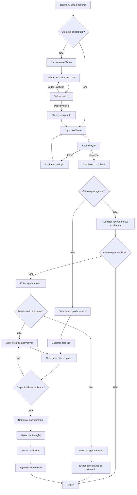
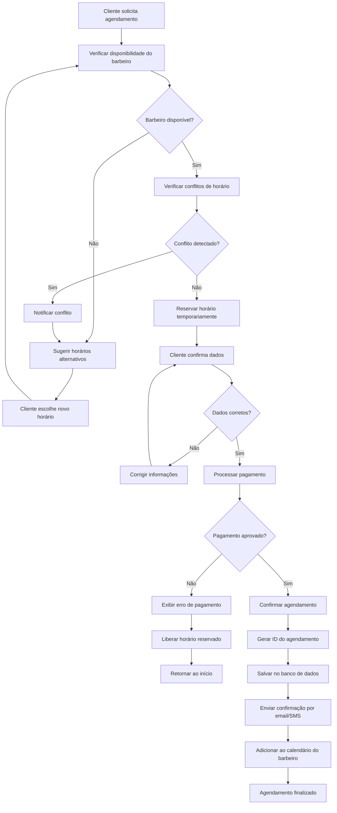
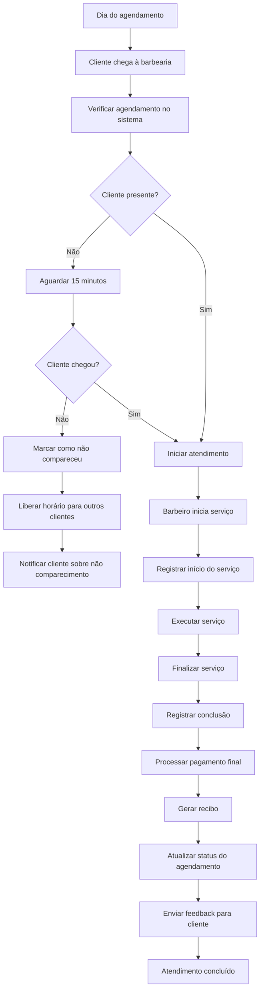
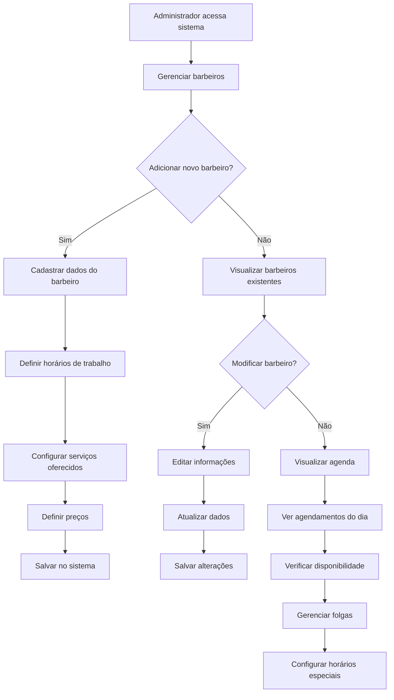
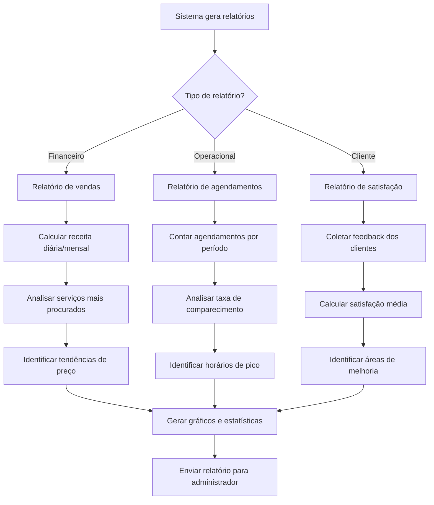

# Fluxograma - Sistema de Agendamento de Barbearia

## Fluxograma Principal do Sistema

## Fluxograma do Processo de Agendamento

## Fluxograma do Dia do Atendimento

## Fluxograma de Gestão de Barbeiros

## Fluxograma de Relatórios e Analytics

## Funcionalidades Principais do Sistema

### 1. **Gestão de Clientes**
- Cadastro e autenticação
- Histórico de agendamentos
- Preferências de serviços
- Dados de contato

### 2. **Gestão de Agendamentos**
- Criação de novos agendamentos
- Modificação de agendamentos existentes
- Cancelamento de agendamentos
- Verificação de disponibilidade

### 3. **Gestão de Barbeiros**
- Cadastro de profissionais
- Horários de trabalho
- Serviços oferecidos
- Agenda individual

### 4. **Gestão de Serviços**
- Catálogo de serviços
- Preços e duração
- Disponibilidade por barbeiro

### 5. **Sistema de Notificações**
- Confirmação de agendamento
- Lembretes automáticos
- Alterações de horário
- Feedback pós-atendimento

### 6. **Relatórios e Analytics**
- Relatórios financeiros
- Análise de ocupação
- Satisfação do cliente
- Performance dos barbeiros

## Tecnologias Sugeridas

- **Backend**: Flask (já implementado) ou FastAPI
- **Frontend**: React, Vue.js ou Angular
- **Banco de Dados**: PostgreSQL ou MySQL
- **Autenticação**: JWT ou OAuth2
- **Notificações**: Email (SMTP) e SMS (APIs)
- **Pagamentos**: Stripe, PayPal ou PagSeguro
- **Deploy**: Docker + AWS/Azure/GCP

